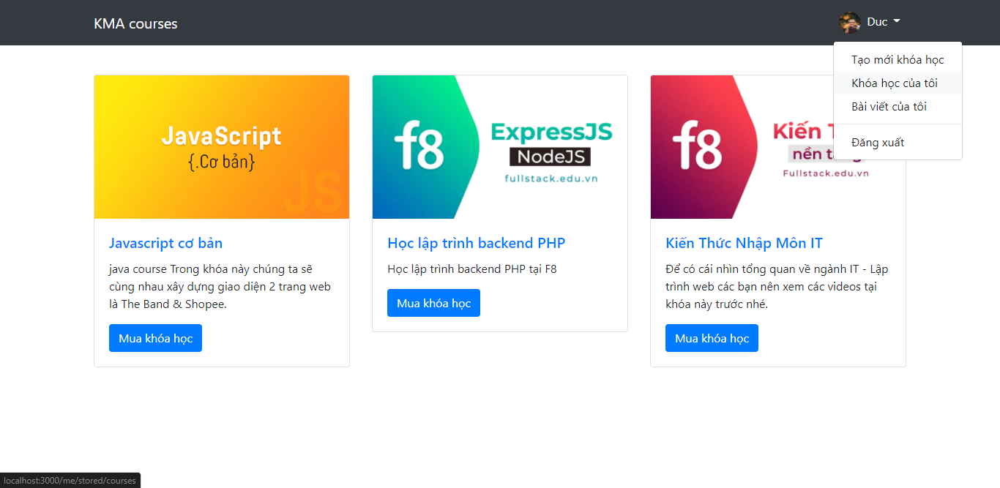
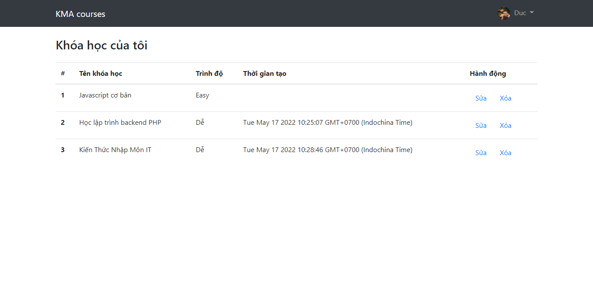

# Dự án cá nhân: Quản lý khóa học
Dự án dựa trên playlist của anh Sơn Đặng (F8), với tính năng CRUD khóa học đơn giản
## Công nghệ
- [NodeJS] - evented I/O for the backend
- [ExpressJs] - Framework cho NodeJS, giúp làm việc với server NodeJS dễ dàng hơn
- [Handlebars] - Template engine dùng trong ExpressJs
- [MongoDB/Mongoose] - Database/ thư viện để tương tác với MongoDB

## Installation
1. Clone git repo, sau đó thay đổi string trong async function connect
```sh
mongodb://localhost:27017/database_name
```
2. npm install
3. npm run watch
4. npm start

## Images


